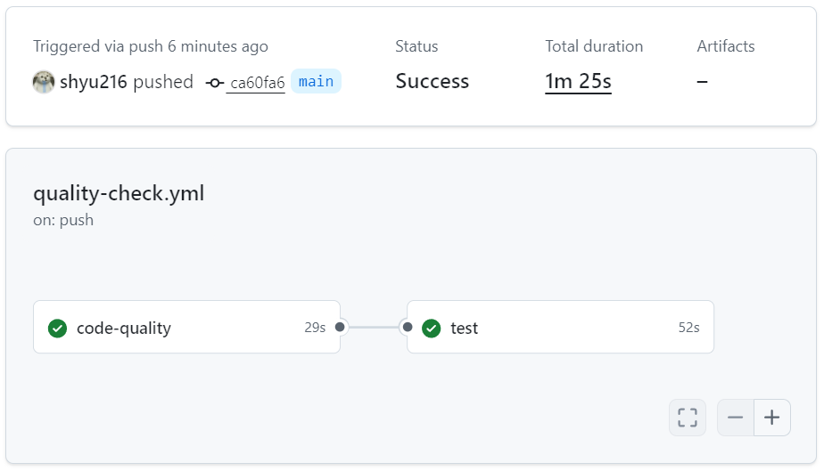
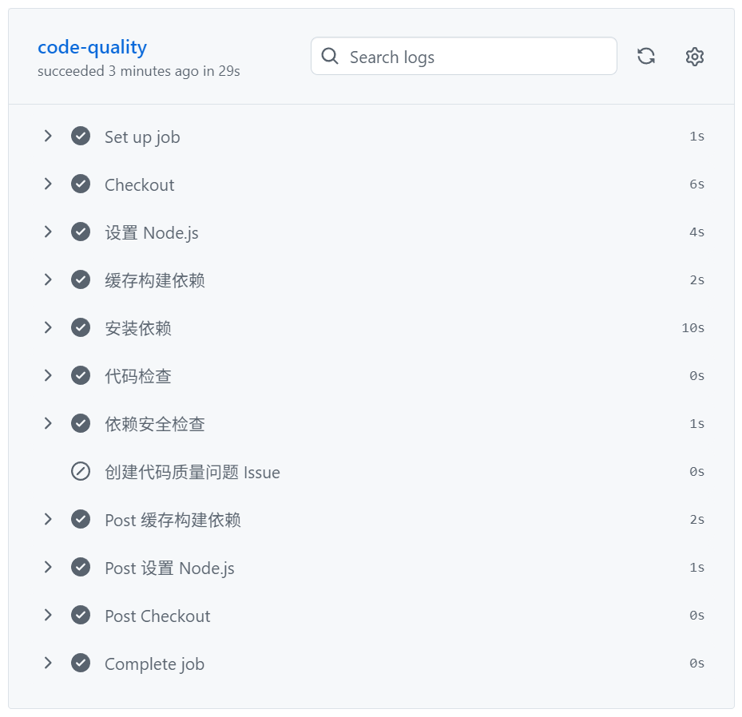
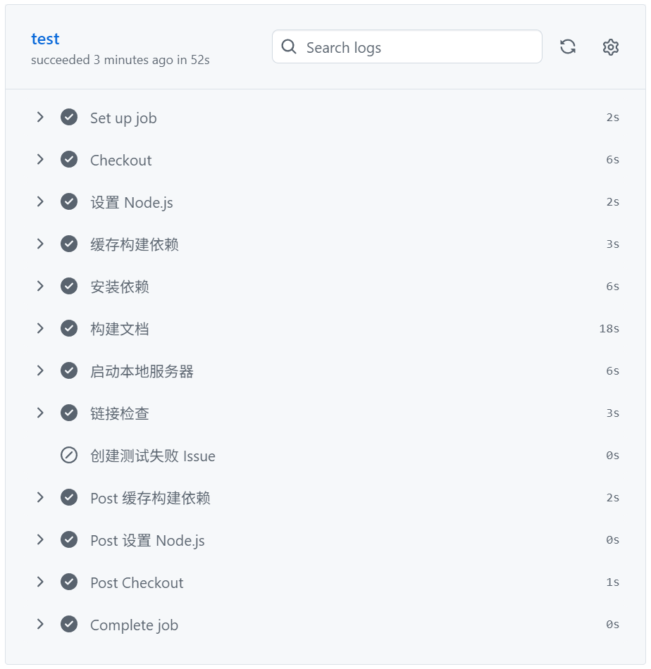

# 当前CI/CD优化

## 什么是 CI/CD？

CI/CD 是持续集成（Continuous Integration）和持续部署（Continuous Deployment）的缩写，是现代软件开发中的重要实践。它通过自动化流程，帮助开发团队更高效、更可靠地交付代码。

### 持续集成（CI）

持续集成是指开发人员频繁地将代码集成到共享仓库中，每次集成都会触发自动构建和测试。这样可以早期发现并解决代码中的问题，避免集成时出现大量冲突。

**CI 的核心好处：**
- 快速发现并修复错误
- 减少集成风险
- 提高代码质量
- 增强团队协作

### 持续部署（CD）

持续部署是在持续集成的基础上，将通过测试的代码自动部署到生产环境。这样可以实现代码的快速交付，缩短从开发到上线的时间。

**CD 的核心好处：**
- 加速产品迭代
- 减少手动部署错误
- 提高部署可靠性
- 实现自动化流程

## CI/CD 的工作流程

一个典型的 CI/CD 工作流程包括以下步骤：

1. **代码提交**：开发人员将代码提交到版本控制系统（如 Git）
2. **触发构建**：CI 系统检测到代码变更，触发构建流程
3. **自动测试**：运行各种测试（单元测试、集成测试等）
4. **代码质量检查**：检查代码风格、安全性等
5. **构建产物**：生成可部署的构建产物
6. **部署**：将构建产物部署到测试或生产环境
7. **监控**：监控部署后的应用状态

## CI/CD 工具

常见的 CI/CD 工具包括：

- **GitHub Actions**：GitHub 内置的 CI/CD 服务
- **Jenkins**：开源的自动化服务器
- **GitLab CI/CD**：GitLab 内置的 CI/CD 服务
- **CircleCI**：云原生 CI/CD 平台
- **Travis CI**：专注于开源项目的 CI 服务

## 项目中的 CI/CD 优化

在我们的项目中，我们使用 GitHub Actions 来实现 CI/CD 流程，并进行了以下优化：

### 优化前的流程
- 检出代码
- 设置 Node.js 环境
- 安装依赖
- 构建文档
- 部署到 GitHub Pages

### 优化后的流程
1. 检出代码
2. 设置 Node.js 环境
3. 安装依赖
4. **代码检查（ESLint）**：添加了代码质量检查步骤，确保代码语法正确
5. **依赖安全检查**：检查依赖包的安全漏洞
6. 构建文档
7. **链接检查**：验证文档网站的链接有效性
8. 部署到 GitHub Pages

### 具体优化措施

1. **添加 ESLint 依赖**：
   - 在 `package.json` 中添加了 ESLint 及相关插件
   - 配置了适合项目的代码检查规则

2. **创建 ESLint 配置**：
   - 创建了 `.eslintrc.js` 配置文件
   - 设置了基本的代码质量规则

3. **重构 CI/CD 工作流**：
   - 将原来的单 job 结构拆分为多个功能明确的 job
   - 将代码质量检查和部署分离为独立工作流
   - 确保在构建前进行代码质量检查

4. **集成到构建流程**：
   - 在 `package.json` 中添加了 `lint` 脚本
   - CI/CD 流程会自动运行代码检查

5. **添加自动问题跟踪**：
   - 在工作流中集成 GitHub CLI
   - 当代码质量检查或测试失败时，自动创建 GitHub Issue

6. **扩展触发条件**：
   - 代码质量检查支持多分支和定时运行
   - 部署工作流专注于 main 分支的变更

### 当前 CI/CD Workflow 结构

当前的 CI/CD 工作流已优化为多 job 结构，包含以下主要阶段：

#### 1. 代码质量检查工作流（quality-check.yml）
- **功能**：检查代码质量和文档链接有效性
- **触发条件**：
  - 推送到 main、develop、feature/** 分支
  - 对 main、develop 分支的 pull request
  - 每周日定时运行
- **包含两个 job**：
  1. **code-quality**：
     - 功能：检查代码语法和依赖安全性
     - 步骤：
       - 检出代码
       - 设置 Node.js 环境
       - 缓存构建依赖
       - 安装依赖
       - 代码检查（ESLint）
       - 依赖安全检查（npm audit）
       - 自动创建代码质量问题 Issue（失败时）

  
  2. **test**：
     - 功能：验证文档网站的链接有效性
     - 依赖：依赖 code-quality job 完成
     - 步骤：
       - 检出代码
       - 设置 Node.js 环境
       - 缓存构建依赖
       - 安装依赖
       - 构建文档
       - 启动本地服务器
       - 链接检查（broken-link-checker）
       - 自动创建测试失败 Issue（失败时）

#### 2. 部署工作流（deploy-docs.yml）
- **功能**：构建并部署文档到 GitHub Pages
- **触发条件**：
  - 推送到 main 分支
  - 变更路径：src/**、package.json、package-lock.json
- **包含一个 job**：
  - **build**：
    - 功能：构建文档并部署到 GitHub Pages
    - 步骤：
      - 检出代码
      - 设置 Node.js 环境
      - 缓存构建依赖
      - 安装依赖
      - 构建文档
      - 创建 .nojekyll 文件
      - 部署文档到 gh-pages 分支

### 工作流触发条件

#### 1. 代码质量检查工作流（quality-check.yml）触发条件：
- **触发事件**：
  - 推送到 main、develop、feature/** 分支
  - 对 main、develop 分支的 pull request
  - 每周日定时运行（0 0 * * 0）
- **触发路径**：
  - src/**（文档内容变更）
  - package.json（依赖变更）
  - package-lock.json（依赖版本锁定变更）

#### 2. 部署工作流（deploy-docs.yml）触发条件：
- **触发事件**：推送到 main 分支
- **触发路径**：
  - src/**（文档内容变更）
  - package.json（依赖变更）
  - package-lock.json（依赖版本锁定变更）

### 工作流优化特点

1. **责任分离**：每个 job 专注于特定功能，便于维护和调试
2. **错误隔离**：某个环节失败不会影响其他环节，便于定位问题
3. **缓存优化**：使用 GitHub Actions 缓存机制，减少依赖安装时间
4. **自动化检查**：集成代码质量检查和链接检查，确保网站质量
5. **安全保障**：依赖安全检查，及时发现并修复安全漏洞
6. **自动问题跟踪**：当代码质量检查或测试失败时，自动创建 GitHub Issue，便于跟踪和修复问题
7. **多分支支持**：代码质量检查支持 main、develop 和 feature 分支，确保所有代码都经过质量检查
8. **定时运行**：每周自动运行代码质量检查，确保代码质量持续保持

### 优化效果

- **提高代码质量**：通过 ESLint 检查，确保代码语法正确，风格一致
- **减少部署失败**：在构建前发现并修复代码问题，减少部署失败的风险
- **标准化流程**：建立了统一的代码质量标准
- **自动化检查**：无需手动运行代码检查，CI/CD 流程会自动处理
- **责任分离**：多 job 结构使每个环节职责明确，便于维护和调试
- **错误隔离**：某个环节失败不会影响其他环节，便于定位问题
- **构建加速**：缓存机制减少了依赖安装时间，提高构建速度
- **链接有效性**：自动检查文档链接，确保用户体验
- **安全保障**：依赖安全检查，及时发现并修复安全漏洞
- **问题自动跟踪**：当代码质量检查或测试失败时，自动创建 GitHub Issue，确保问题得到及时跟踪和修复
- **全分支覆盖**：代码质量检查覆盖 main、develop 和 feature 分支，确保所有代码都经过质量检查
- **持续质量保障**：每周定时运行代码质量检查，确保代码质量持续保持

## 优化后的 CI/CD 流程优势

通过本次 CI/CD 优化，我们获得了以下优势：

- **提高代码质量**：ESLint 代码检查确保代码语法正确，风格一致
- **减少部署失败**：在构建前发现并修复代码问题，降低部署风险
- **标准化流程**：建立了统一的代码质量标准，提高代码可维护性
- **自动化检查**：无需手动运行代码检查，CI/CD 流程会自动处理
- **快速反馈**：代码提交后立即得到质量反馈，缩短问题修复时间
- **问题自动跟踪**：当代码质量检查或测试失败时，自动创建 GitHub Issue，确保问题得到及时跟踪和修复
- **全分支覆盖**：代码质量检查覆盖 main、develop 和 feature 分支，确保所有代码都经过质量检查
- **持续质量保障**：每周定时运行代码质量检查，确保代码质量持续保持
- **工作流分离**：将代码质量检查和部署分离为独立工作流，提高流程清晰度和可维护性

## 可直接在 Workflow 中实现的优化

以下优化可以直接在 `deploy-docs.yml` 中实现：

1. **集成 Dependabot**：通过 GitHub 仓库设置启用，无需修改 workflow 文件
2. **添加链接检查**：在 workflow 中添加 broken-link-checker 步骤
3. **优化构建性能**：配置缓存和并行构建
4. **添加依赖安全检查**：集成 Snyk 或 npm audit 到 workflow

## 需要您协助的优化

以下优化需要您的协助：

1. **集成 CodeRabbit**：需要在 GitHub 仓库中安装 CodeRabbit App
2. **添加文档质量检查**：需要选择合适的 Markdown 检查工具
3. **实现错误自动排查**：需要编写分析脚本并配置 GitHub API 权限
4. **添加 SEO 检查**：需要配置 SEO 检查工具和相关参数
5. **实现自动化测试**：需要编写测试用例和配置测试环境
6. **构建监控系统**：需要设置监控服务和报警机制

## 结论

本次 CI/CD 优化通过以下措施显著提高了项目的代码质量和部署可靠性：

1. **分离工作流**：将代码质量检查和部署分离为独立工作流，提高流程清晰度和可维护性
2. **增强代码质量检查**：添加 ESLint 代码检查和依赖安全检查，确保代码语法正确，风格一致
3. **添加链接检查**：验证文档网站的链接有效性，确保用户体验
4. **实现自动问题跟踪**：当代码质量检查或测试失败时，自动创建 GitHub Issue，确保问题得到及时跟踪和修复
5. **扩展触发条件**：支持多分支检查和定时运行，确保代码质量持续保持

优化后的流程能够自动检测并阻止有问题的代码进入构建和部署阶段，从而减少了部署失败的风险，提高了开发效率。

通过持续优化 CI/CD 流程，我们可以进一步提高项目的质量和开发效率，为用户提供更好的文档网站体验。建议按照上述规划逐步实施优化，从最核心的痛点开始，逐步提升 CI/CD 流程的智能化和自动化水平。