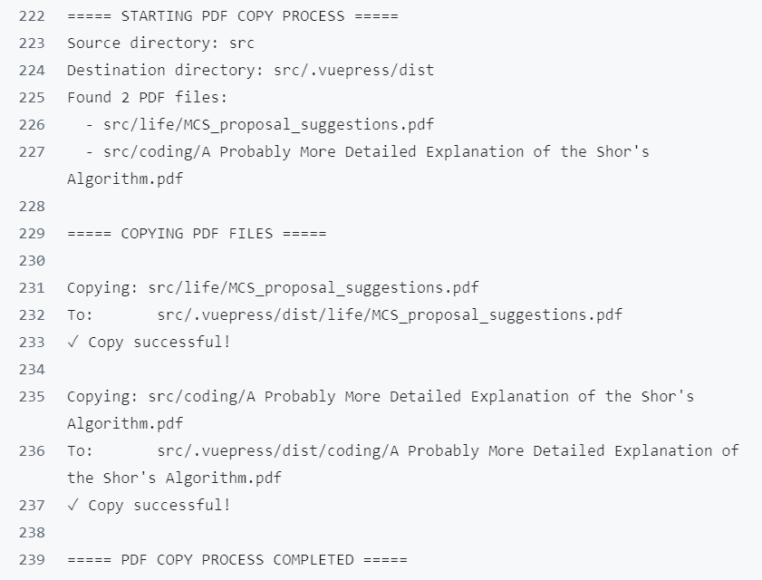
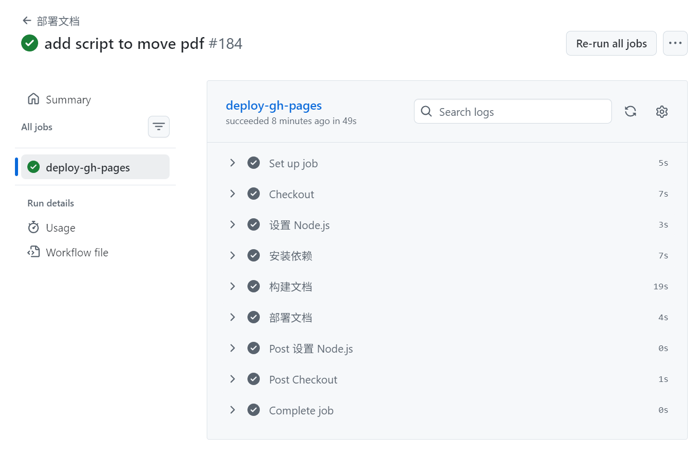

## 问题描述
在构建部署后，PDF文件链接出现404错误，URL被自动重写为带有`.html`后缀的形式，导致无法访问PDF文件。

## 原因分析
1. **路径问题**：原PDF链接使用了相对路径，导致构建后路径不正确
2. **VuePress构建机制**：VuePress默认不会自动复制Markdown文件同目录下的PDF文件到构建目录
3. **URL重写**：由于PDF文件不存在于构建目录中，服务器返回404错误，并且尝试将请求重写为HTML页面

## 解决方案

### 1. 修改PDF链接路径
将`shor.md`文件中的PDF链接从相对路径修改为绝对路径：

```markdown
<!-- 修改前 -->
<PDF url="./A Probably More Detailed Explanation of the Shor's Algorithm.pdf" />


<!-- 修改后 -->
<PDF url="/coding/A%20Probably%20More%20Detailed%20Explanation%20of%20the%20Shor's%20Algorithm.pdf" />
```

### 2. 创建PDF复制脚本
创建了`scripts/copy_pdfs.py`脚本，用于在构建过程中自动复制所有PDF文件到构建目录：

```python
import os
import shutil
import glob

print("===== STARTING PDF COPY PROCESS =====")

# 定义源目录和目标目录
src_dir = 'src'
dist_dir = 'src/.vuepress/dist'

print(f"Source directory: {src_dir}")
print(f"Destination directory: {dist_dir}")

# 查找所有PDF文件
pdf_files = glob.glob(os.path.join(src_dir, '**', '*.pdf'), recursive=True)

print(f"Found {len(pdf_files)} PDF files:")
for pdf_file in pdf_files:
    print(f"  - {pdf_file}")

if not pdf_files:
    print("No PDF files found. Exiting...")
else:
    print("\n===== COPYING PDF FILES =====")
    for pdf_file in pdf_files:
        # 计算相对路径
        relative_path = os.path.relpath(pdf_file, src_dir)
        # 构建目标路径
        dest_path = os.path.join(dist_dir, relative_path)
        # 确保目标目录存在
        os.makedirs(os.path.dirname(dest_path), exist_ok=True)
        print(f"\nCopying: {pdf_file}")
        print(f"To:       {dest_path}")
        # 复制文件
        try:
            shutil.copy2(pdf_file, dest_path)
            print("✓ Copy successful!")
        except Exception as e:
            print(f"✗ Copy failed: {e}")

print("\n===== PDF COPY PROCESS COMPLETED =====")
```

### 3. 更新构建命令
修改了`package.json`文件，在构建命令中添加了复制PDF文件的步骤：

```json
"scripts": {
  "docs:build": "vuepress-vite build src && python scripts/copy_pdfs.py",
  // 其他脚本...
}
```

## 验证结果
1. 本地构建测试：成功复制PDF文件到构建目录

2. 构建输出：PDF文件正确出现在`src/.vuepress/dist/coding/`目录中
3. 链接测试：PDF链接现在指向正确的路径，不再出现404错误


## 技术要点
- **VuePress静态资源处理**：VuePress默认只处理指定目录的静态资源，需要手动处理其他文件
- **GitHub Actions部署**：通过workflow自动将构建产物部署到gh-pages分支
- **跨平台脚本**：使用Python编写跨平台的文件复制脚本，确保在不同环境下都能正常运行

## 未来优化
- 考虑将PDF文件统一放在`public`目录下，利用VuePress的静态资源处理机制
- 可以添加更多的错误处理和日志记录，提高脚本的健壮性
- 考虑使用VuePress插件来处理PDF文件，简化构建流程
