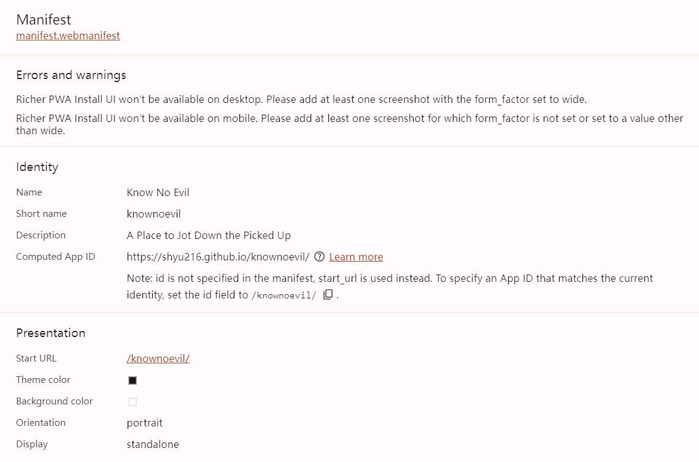
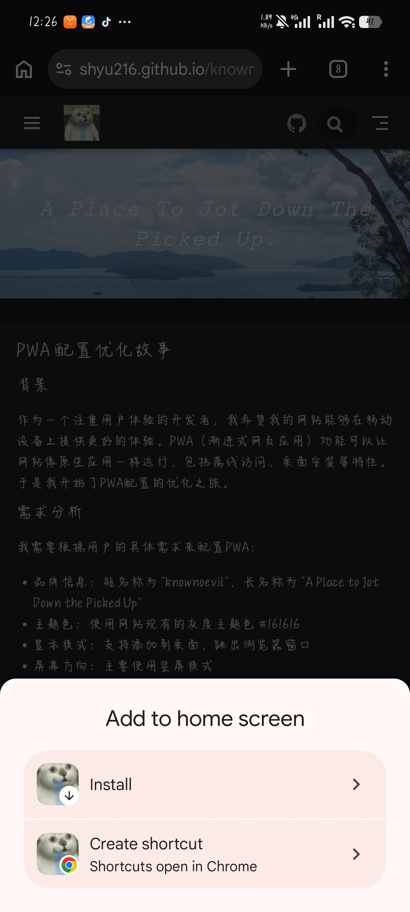

# PWA 配置优化

## 背景

作为一个注重用户体验的开发者，我希望我的网站能够在移动设备上提供更好的体验。PWA（渐进式网页应用）功能可以让网站像原生应用一样运行，包括离线访问、桌面安装等特性。于是我开始了PWA配置的优化工作。

## 需求分析

我需要根据用户的具体需求来配置PWA：

- **品牌信息**：短名称为 "knownoevil"，长名称为 "A Place to Jot Down the Picked Up"
- **主题色**：使用网站现有的灰度主题色 #161616
- **显示模式**：支持添加到桌面，跳出浏览器窗口
- **屏幕方向**：主要使用竖屏模式
- **设备测试**：需要在小米13和iPad上测试

## 探索阶段

首先，我检查了现有的PWA配置，发现缺少一些关键内容：

1. **Manifest基本信息**：缺少应用名称、描述、主题色等
2. **手机端适配**：缺少屏幕方向配置
3. **图标配置**：可以添加更多尺寸的图标

同时，我检查了icon目录，确认所有需要的图标文件都存在：
- android-chrome-192x192.png
- android-chrome-512x512.png
- apple-touch-icon.png
- favicon-16x16.png
- favicon-32x32.png
- guide-maskable.png

## 实施过程

### 1. 完善Manifest配置

我添加了完整的Manifest信息：

- **应用名称**：A Place to Jot Down the Picked Up
- **短名称**：knownoevil
- **描述**：记录一些黑知识，抱尊重来记录
- **主题色**：#161616（从网站现有配置中获取）
- **背景色**：#ffffff
- **启动URL**：/knownoevil/ 
- **显示模式**：standalone（支持添加到桌面）
- **作用域**：/knownoevil/
- **屏幕方向**：portrait（竖屏）

### 2. 优化Apple设备适配

为了在Apple设备上有更好的表现，我添加了：

- **maskIcon**：使用现有的guide-maskable.png
- **statusBarColor**：设置为black，与网站风格一致

### 3. 完善图标配置

我添加了更多尺寸的图标，确保在不同设备上都有良好的显示效果：

- 512x512（maskable）
- 192x192（maskable）
- 512x512
- 192x192
- 32x32
- 16x16

### 4. 保持更新机制

保留了之前配置的 "hint" 模式，确保用户能够及时获取最新内容：

- **update**："hint"（在检测到更新时立即显示提示）

## 技术细节

### PWA的工作原理

1. **Web App Manifest**：提供应用的基本信息，使应用可以被添加到主屏幕
2. **Service Worker**：负责缓存资源、处理离线访问
3. **响应式设计**：确保在不同设备上都能正常显示

### 配置示例

#### Manifest配置

#### 移动设备Chrome安装提示

### PWA配置字段说明

#### 基本信息
- **name**：应用名称，显示在应用安装对话框、应用列表和启动屏幕上
- **short_name**：短名称，当空间有限时显示，如主屏幕图标下方
- **description**：应用描述，提供应用的简短说明，显示在应用商店或安装对话框中

#### 外观配置
- **theme_color**：主题颜色，定义应用的主题颜色，影响浏览器地址栏、状态栏等
- **background_color**：背景颜色，定义应用启动时的背景颜色
- **icons**：应用图标，提供不同尺寸和用途的图标，确保在不同设备上都有良好的显示效果

#### 行为配置
- **start_url**：启动URL，应用启动时打开的页面
- **display**：显示模式，定义应用的显示方式
- **scope**：作用域，定义应用的导航范围
- **orientation**：屏幕方向，定义应用的首选屏幕方向

### 显示模式说明

- **standalone**：应用会在独立的窗口中运行，没有浏览器的地址栏和工具栏，提供类原生应用的体验
- **browser**：应用会在浏览器窗口中运行，显示地址栏和工具栏
- **minimal-ui**：应用会在带有最小工具栏的窗口中运行

我选择了 "standalone" 模式，因为它最接近原生应用的体验，符合用户的需求。

## 触发条件注意事项

### Chrome自动安装提示触发条件

PWA要在Chrome浏览器中自动显示安装提示，需要满足以下条件：

1. **HTTPS访问**：网站必须通过HTTPS协议访问
2. **访问频率**：用户需要访问网站至少两次
3. **时间间隔**：两次访问间隔至少5分钟
4. **用户交互**：用户未拒绝过之前的安装提示
5. **Service Worker**：网站已注册Service Worker
6. **Manifest配置**：网站有有效的Web App Manifest

### 手动安装方法

当自动提示未触发时，用户可以通过以下步骤手动安装：

1. **打开Chrome菜单**：点击浏览器右上角的三个点
2. **选择添加到主屏幕**：在菜单中找到并点击此选项
3. **选择安装方式**：
   - **Install**：完整安装为PWA应用，在独立窗口运行
   - **Create shortcut**：创建浏览器快捷方式，在Chrome中打开

## 部署注意事项

### GitHub Pages子路径部署

当站点部署在GitHub Pages的子路径（如 `username.github.io/repo-name/`）时，需要特别注意以下配置：

1. **start_url**：必须设置为子路径，如 `"/knownoevil/"`
2. **scope**：必须设置为子路径，如 `"/knownoevil/"`
3. **图标路径**：VuePress会自动为图标路径添加base前缀，确保图标能够正确加载
4. **shortcuts**：中的 `url` 会自动添加base路径，因此可以设置为 `"/"`

### 配置验证

构建后检查生成的 `manifest.webmanifest` 文件，确保：
- `start_url` 指向正确的子路径
- `scope` 限制在子路径范围内
- `icons` 和 `shortcuts` 中的路径都包含子路径前缀

这样配置后，PWA应用安装后会直接打开 `https://shyu216.github.io/knownoevil/` 而不是根路径。

## 预期效果

通过这些配置优化，网站应该能够：

1. **在移动设备上提供更好的体验**：支持添加到桌面，像原生应用一样运行
2. **保持品牌一致性**：使用与网站一致的主题色和品牌信息
3. **支持离线访问**：用户可以在没有网络的情况下访问网站内容
4. **及时更新**：用户能够及时获取最新的内容更新

## 结论

PWA配置优化是提升网站用户体验的重要步骤，特别是在移动设备上。通过完善Manifest配置、优化设备适配和图标配置，我们可以为用户提供更好的浏览体验。

这次优化不仅满足了用户的具体需求，还保持了网站的品牌一致性，为未来的功能扩展奠定了基础。
