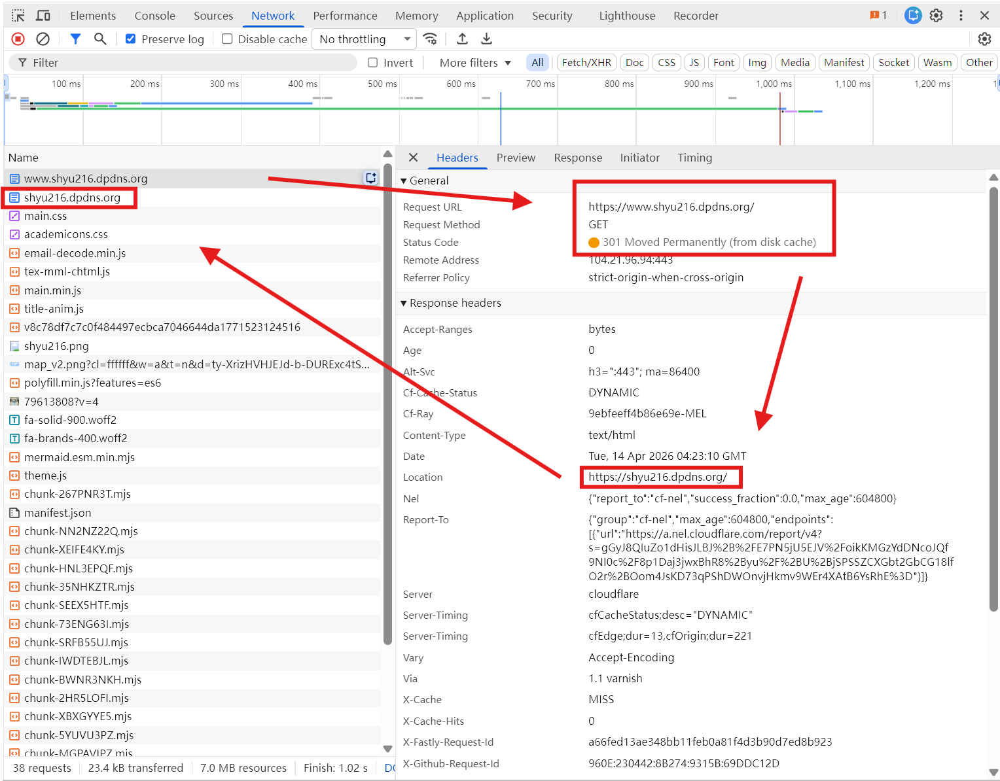
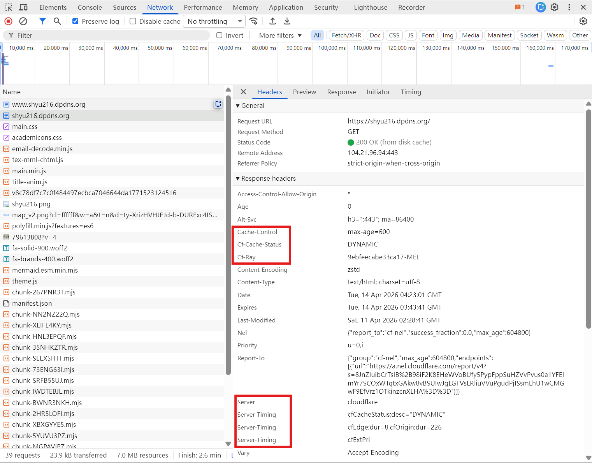

墨尔本下了一个星期的雨，难道四月就入冬了？

近来摆弄yeluyelu的时候意识到国内github有时候上不去，所以想看看怎么优化。人话就是把我的网页从shyu216.github.io搬到shyu216.dpdns.org。

### 目前免费的静态网页部署服务

在dale信息茧房里面听说比较多的是vercel，github pages，cloudflare pages。当然很可能有很多是dale不知道的。

之前工作用到的aws的amplify也属于这个范畴。基本框架是有一个worker，自动运行一些代码，然后打包manifest，再送你一个域名，或者自己配置，然后大家就能访问了。

最开始是vercel，比如我把我的简历放在了[这儿，域名在vercel点app下面](https://shyu-resume.vercel.app/)，不过这个比github io墙得狠。配置方法是用的直接命令`node scripts/gen-last-update.js && npm run build`。

之后接触到的是github io，可以放到[这儿](https://shyu216.github.io/shyu-resume/)，测了一下似乎只有电信能打开。方法是基于github actions写一个workflow的yml，把各个branch的内容都打包放到`gh-pages`分支。

还有就是cloudflare pages，也可以放到[这儿，域名是pages点dev](https://shyu-resume.pages.dev/)，国内居然全绿（20260414），看上去挺好的。

不过目前我的东西都在github了，都是我io域名的不同path，配置起来都更方便。workflow也可以写得更灵活。虽然只有静态后端，但也都用。有空再捣鼓捣鼓动态后端。

### 怎么把shyu216.github.io搬到shyu216.dpdns.org

cloudflare是一个综合性的网络服务商，它把 DNS（domain name system，域名系统，互联网的GPS） 解析、CDN（content delivery network，内容分发网络，把服务器内容提前放到世界各地的仓库） 加速和网络安全防护（防ddos，即distributed denail-of-service分布式拒绝服务攻击，有组织的网络“交通堵塞”；阻止服务器ip直连）等功能整合到了一起。

当你有了一个域名以后，你可以给它在cloudflare里面配置一系列的DNS记录，比如它及其子域名的实际ip是什么（A，AAAA），别名（CNAME，canonical name），邮箱系统（MX，让别人找到admin@shyu216.dpdns.org应该投给谁），文本记录（TXT，可以让别人知道的你的留言）。然后nameserver就会帮你把这些记录告诉浏览器。 

比如说，我现在去域名提供商dpdns免费注册了一个域名shyu216.dpdns.org，然后在cloudflare添加域名的配置，然后把生成的name service添加到dpdns。域名提供商的任务就完成了，只需要在域名到期前，重新把它更新到期日期就行。

现在可以在cloudflare的根的A类型写上github的ip，同时再在github设置里面写上我们新的shyu216.dpdns.org，最后启用默认的橙色云代理。
这样代理会帮我们去github ip要数据，返回给用户。用户端看见的就是代理cdn的ip，用户也不会和github接触。

github也能认出这个域名对应是哪个仓库，返回正确的数据。

现在用户在输入我们网址后，浏览器经过一通寻找，从org，到dpdns，最后shyu216.dpdns.org会指向我们ns。ns会直接返回cdn节点ip，然后后续https的请求，这个ip的服务器会帮用户去实际ip（回源）请求数据、缓存、返回。

### 看看日志

现在我们打开www.shyu216.dpdns.org，可以看见它返回了301，告诉我们东西在shyu216.dpdns.org。

接着浏览器有了第二个req，即shyu216.dpdns.org。res里面就是我们html内容了。看到我们服务器是cloudflare，而不是AmazonS3这类服务器，所以这就是cdn起作用了。

### 测一测shyu216.github.io和shyu216.dpdns.org

可以看到它们俩的返回ip不一样了，然后org的失败也更少了。

::: details shyu216.github.io

:::

::: details shyu216.dpdns.org

:::

### 关于防火长城

弄到这里似乎对防火长城的理解就更清晰了。

https数据在流动的时候，会有层层关卡，它有可能直接挡掉了域名（DNS污染，告诉你假的ip），也有可能直接封锁了ip。

vpn（virtual private network，虚拟专用网络）相当于是把你真正想去的地方加密起来，先让你去到vpn服务器的地址，然后vpn服务器帮你去最终的地方，就像是个代理（proxy）。

1.1.1.1似乎是一种更高形式的vpn，直接让你去找cloudflare它自己的dns，而不会被运营商的dns设卡。相当于从乡道直接去到了国际高速，而不用在收费站排队。

### 后记

嘿嘿终于明白一点点了，之后看看有没有办法研究研究原神的加速。

