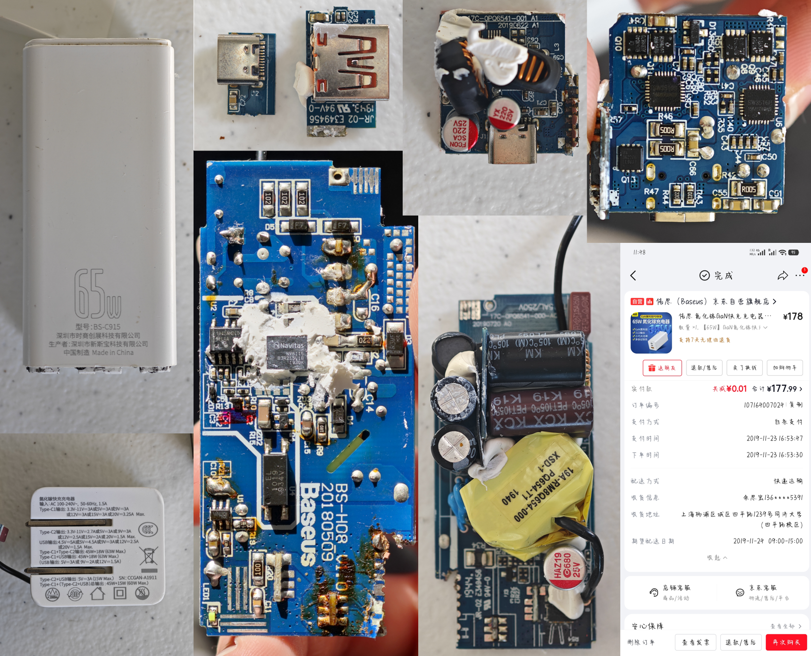

这是一个大一上学期买的充电器，记得是在冬天的同济大学收货的，那真是一个有意思的日子。

流水的充电线，铁打的充电头，已经很难数到底换了多少条充电线了，就连ipad尾插都换了两次。最近终于它的插脚断了，干脆拆了它看看究竟。

它里面有：220V 市电 → 高压整流滤波 → 高频功率变换（GaN 核心） → 低压整流输出 → 反馈稳压保护

## 🔍 拆解后的「五脏六腑」

## 一、外壳&PCB主板标识
| 文字/标识 | 扫盲解释 |
| :--- | :--- |
| `65W` | 充电器的**额定最大功率**，表示它最高能输出65W的功率 |
| `型号: BS-C915` | 倍思官方的产品型号，方便识别产品批次/规格 |
| `深圳市时商创展科技有限公司` | 品牌方倍思的母公司主体 |
| `深圳市新斯宝科技有限公司` | 代工厂，负责生产制造 |
| `Made in China` | 中国制造 |
| `输入: AC 100-240V~, 50-60Hz, 1.5A` | 市电输入规格： - 电压：100-240V（全球通用宽幅电压） - 频率：50/60Hz（国内/国外市电标准频率） - 最大输入电流：1.5A |
| `Type-C1/Type-C2/USB-A` 输出参数 | 多口充电的规格说明，包含不同电压档位下的最大电流，比如`5V=3A`、`9V=3A`、`12V=3A`、`20V=3.25A`，对应PD快充协议 |
| `CCGAN-A1911` | 产品的认证编号/内部型号，用于质检备案 |
| `CCC`标志 | 中国强制性产品认证，代表符合国内安全标准 |
| `Baseus` | 品牌logo，倍思 |
| `BS-H08 V1.0` | 电路板的型号&版本号 |
| `20180509` | 电路板的生产日期（2018年5月9日） |
| `JR-02 E349456` | 电路板的安规型号&UL认证编号，代表符合安全标准 |
| `94V-0` | PCB的阻燃等级，V-0级是最高阻燃等级，遇到明火会自熄 |
| `1944.` | 生产批次/日期码，对应2019年第44周生产 |
| `C16/C14/R15/R21/LED1` | 电路板上的**元器件位号**： - `C`开头=电容 - `R`开头=电阻 - `LED`开头=指示灯 |
| `102` | 贴片电阻的阻值代码，`102`=10×10²=1kΩ |

## 二、高压整流滤波区（220V 市电 → 300V 直流高压｜高危区）
市电插座里的220V是交流电，电压持续正负波动，必须先完成整流、滤波、抗干扰，转化为稳定直流高压，也是拆机**最容易触电、存残电**的区域。

1. **KCX PET 105℃ K19｜棕色NTC热敏电阻**
    - 参数：耐温105℃，负温度系数热敏电阻
    - 作用：通电瞬间抑制浪涌大电流，防止电容被电流冲炸；工作发热后电阻降低，不影响正常供电。
2. **KM 105℃ PL02｜黑色X2安规电容**
    - 参数：耐温105℃，X2级抗干扰安规电容
    - 作用：并联在火线、零线之间，滤除电网高频杂波，抑制电磁干扰，是电源强制安规件。
3. **JEC 681K 1KV｜蓝色Y1安规瓷片电容**
    - 参数：容量680pF，精度±10%，耐压1000V，带多国安规认证
    - 作用：串联在高压回路，辅助滤除高频干扰；核心作用是**限制漏电电流**，防止充电时220V市电顺着数据线传导，导致摸手机金属壳被电麻，是防触电的关键安全件。
---

## 三、高频功率变换区（GaN核心｜整机心脏）
这是氮化镓充电器和普通硅基充电器的核心区别，也是实现**小体积、大功率、低发热**的关键。

1. **19A‑RM8Q654‑000 PQ654‑T1｜黄色高频隔离变压器**
    - 参数：PQ654高频磁芯，2019年第40周生产
    - 作用：将300V高压直流，降压为20‑25V低压交流；同时实现**高压侧与低压侧电气隔离**，从物理层面杜绝市电触电风险。
2. **Navitas NV6115｜核心氮化镓芯片**
    - 参数：Navitas（纳微）的 NV6115 是标准650V GaNFast 氮化镓功率 IC
    - 作用：每秒完成数十万次高频开关，控制高压能量向变压器传输；相比传统硅MOS管，氮化镓开关速度快10倍、发热极低、损耗更小，是65W大功率塞进小体积的核心。
---

## 四、低压整流输出区（25V低压交流 → 手机安全直流电｜安全区）
变压器输出的低压交流电，需再次整流、滤波，转化为纯净、稳定的直流电，全程与市电高压完全隔离，无触电风险。

1. **HAZ19 680 25V｜低压电解电容**
    - 参数：容量680μF，额定耐压25V
2. **FCON SCA 220 25V、YX 220 25V｜低压电解电容**
    - 参数：容量220μF，额定耐压25V
    - 作用：多颗电容并联，滤除快充电流杂波、稳定输出电压，应对快充瞬间大电流冲击。
3. **RUH4040、AON1870｜同步整流MOS管**
    - 作用：替代老式低效二极管，将低压交流电高效转化为直流电，导通损耗极低，大幅降低充电器发热。
4. **R005、R022｜高精度电流采样电阻**
    - 参数：阻值0.005Ω、0.022Ω（毫欧级）
    - 作用：串联在输出回路，实时检测输出电流，为保护、快充控制提供数据反馈。

---

## 五、反馈稳压与快充控制区（整机大脑）
决定充电器能否触发65W满速快充，同时集成全部安全保护机制。

1. **SW3516｜快充协议主控芯片**
    - 作用：和手机握手通信，自动识别PD/QC/SCP等快充协议，动态调节输出电压、电流档位，实现65W满速快充；同时集成过压、过流、过热、短路全维度保护。
---