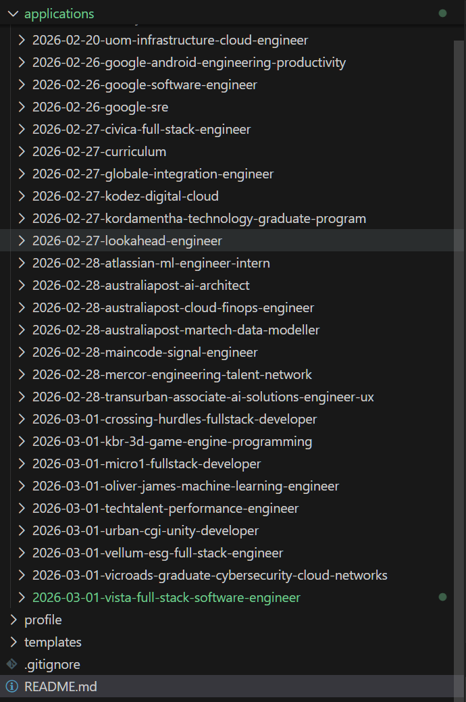

Locked. This content is already encrypted in Chinese!

这是本小白第一次全面备战一次招聘季，随便写点什么。可能已经踩了一些坑我不知道的，如果有观众，欢迎吃瓜参考。希望别是全聚德。

目前墨大mscs毕业，一段10个月香港初创fullstack，2000小时wakatime。算法课上挺多，leetcode没咋刷过。面试经验1，面试别人经验3，很水。

目标是entry-level 或者graduate program（gp）的software/data/cloud/network 的各种工。最好是墨尔本，至少是澳洲，485签证不能浪费。

材料

- [x] Cover Letter
- [x] Resume

平台 

- unimelb career https://careersonline.unimelb.edu.au/
- seek / seekgrad
- linkedin
- 小红书？全是中介。小心智商税！一报名五千🔪。（腾讯的同学说，拿他的内推吗注册，他能加工资，也是一种kpi手段罢了）

能去的地方

- 澳洲 Big 4 科技岗
  - PwC
  - Deloitte
  - KPMG
  - EY

- 银行科技
  - CBA
  - Westpac
  - ANZ
  - NAB

- 云 & 科技大厂
  - Google
  - Microsoft
  - AWS
  - Oracle
  - SAP
  - Atlassian

- 互联网 / SaaS
  - Atlassian
  - Canva
  - REA
  - Seek

- 政府 / 半政府 GP
  - AEMO
  - Services Australia
  - 各州政府 IT

- 中型 IT 企业
  - Seek / LinkedIn 海量投递

## 一些投递记录

### Atlassian

https://globalcareers-atlassian.icims.com/jobs

墨大网站上看是现在只招在上学的的summer intern，卡pr。等等gp。

### ACS Foundation

https://www.foundationjobs.com.au/FoundationJobs/msdynamicsconsultant

墨大网站找的，ngo组织对接学生和合作企业？交申请后第二天打了个电话，说简历递给企业了。

### 两个小小厂

墨大网站有两个<5人的厂，招parttime，怕太累，也怕没sponsor，没投。

### 墨大

招个level 6的cloud infra，投递被秒拒，我确实没这个工作经验。

### AEMO

https://job-boards.greenhouse.io/australianenergymarketoperator/jobs/4130426009

找cyber security的gp，做了online assessment，是玩游戏，紧张刺激。拒了。

### Tiktok

https://lifeattiktok.com/position/application

申了俩，悉尼的intern。security/backend

### IBM

https://careers.ibm.com/en_US/careers/OpenJobs

没有合适的。

### Canva

https://www.lifeatcanva.com/en/jobs/

没有合适的。

### Microsoft

https://apply.careers.microsoft.com/careers/dashboard?domain=microsoft.com

申了五个，五个software。自动解析简历，过滤了好多strong match的，投递很方便。

### PwC

https://jobs-au.pwc.com/au/en/home

投了tech的gp，做完assessment，拒了。可能是因为very shy、contented，下次都填strong agree试试。

assessment有个有趣的generative AI的问卷。我虽然天天vibe coding，对于这些似乎不求甚解。它擅长做什么？文本的话，我一般都是人工筛选有用的信息，复制粘贴，再让ai拼接，rephrase，重复，直到满意。而coding，有点看运气了，有时能跑通，有时就加一堆奇怪需求，写长长readme。

### Google

https://www.google.com/about/careers/applications/dashboard

30天最多投三个，三个software。

### AWS

https://account.amazon.jobs/en-US/applicant

投了两个，softeware/network。

### 投了一堆linkedin小厂，就不记录了吧，偷懒

有家叫mindcode的startup，挂着量子计算工程师，招signal engineer，大概是训练llm的？好奇怪，不太懂。

## 新的流水线

投了一个星期没效果，看见reddis有挺多ai修改简历的广告，说是要定制让简历和工作匹配，收费还挺贵。但哪有我家豆包给力，直接让它给我搭一个。

写了一个自己能想起来的所有经历，准备了自己改得比较满意的cover letter，和overleaf流行的resume模板，然后下面是和job description一起丢给ai的prompt。目前只试了doubao-seed-2和gpt5.1-codex-max。gpt完胜，豆包的tex老是出毛病，漏一些排版。ai虽好，但要double check哦！

```md
# Job Description Guide

When processing a Job Description (JD):
1. Copy the original JD content into the designated area.
2. Rate the extent of match between the JD requirements and personal experience (quantify or describe the matching degree clearly). Write a matching analysis in Chinese (focus on must-haves/nice-to-haves, key requirements, and personal fit points).

# Resume Generation Guide 

Please analyze my full work and project experience in `profile\skillbase.md`.
For a given job description (JD), do the following:

1. Extract all my experience bullet points in detail.
2. Rephrase and prioritize them to match the JD keywords.
3. Put the most relevant items into the Experience and Projects sections.
4. Put less relevant but still related skills only into the Skills section.
5. Output clean, ATS-friendly content ready for LaTeX resume as template in `templates\cv.tex`. Keep the style and configuration of the template.
6. Double-check and escape LaTeX specials (e.g., `\%`, `\#`, `\&`) before compiling. Pay special attention to C# (use `\#`), and ensure the entire preamble (content before `\begin{document}`) is correctly copied.

# Cover Letter Generation Guide

Please refer to the template in `templates\cover.md`.
For a given job description (JD), do the following:

1. Check `profile\info.md` for any possible info changes.
2. Update employer's name and job title if needed.
3. Think of 2-3 concrete matches between the job requirements and my experience. Use specific evidence (e.g., project results, technical skills used) to prove fit.
4. Avoid fluff and empty statements. Short paragraphs, no bullet points, no symbols. Smooth, logical flow. Clean plain text, zero redundancy—like well-written code (clear, precise, elegant).
5. Don't forget visa 485, it is needed in Au market.
6. Consolidate the final cover letter content into the corresponding section in `cover.md`.

# Given a JD, ultimately achieve:

For each job, create a folder named `applications/YYYY-MM-DD-company-role/` containing:
- `jd.md` (raw JD, parsed requirements, notes, follow-ups)
- `cv.tex` (tailored CV; copy from templates/cv.tex and edit fields)
- `cover.md` (tailored cover letter; copy from templates/cover.md)
- outputs: `cv.pdf`, `cover.pdf`

Suggested steps:
1) Paste JD into `jd.md` and summarize must-haves/nice-to-haves.
2) Select matching bullets from `experience/` and adjust `cv.tex` for this role.
3) Update `cover.md` with 2-3 concrete matches and a clear call-to-action.
4) Log application status/dates inside `jd.md`.
5) Run `latexmk -pdf cv.tex` and `pandoc cover.md -o cover.pdf` to generate PDFs.
```

效果大概这样子，助我好运吧~

