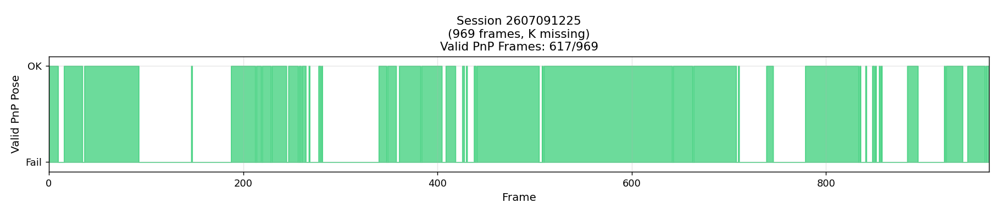
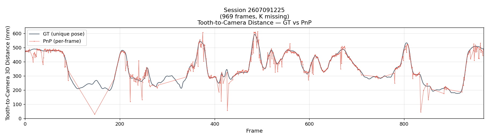
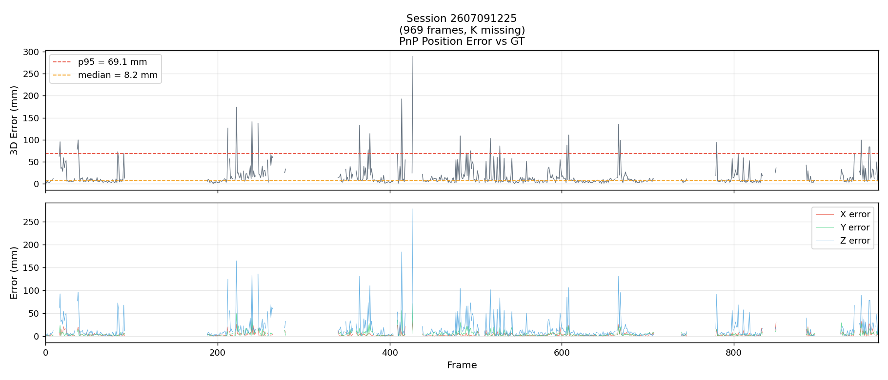
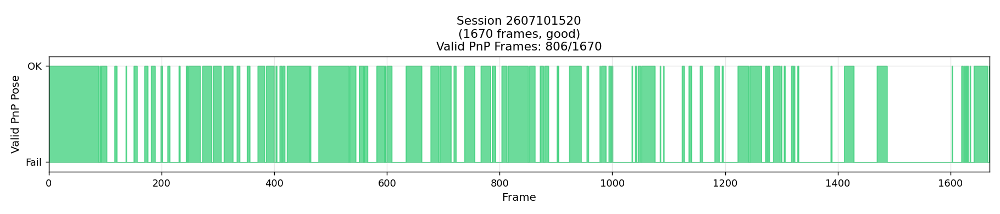
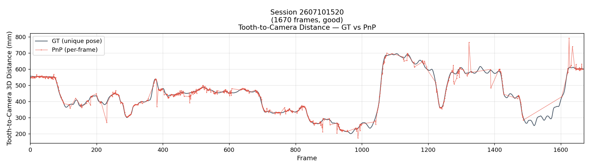
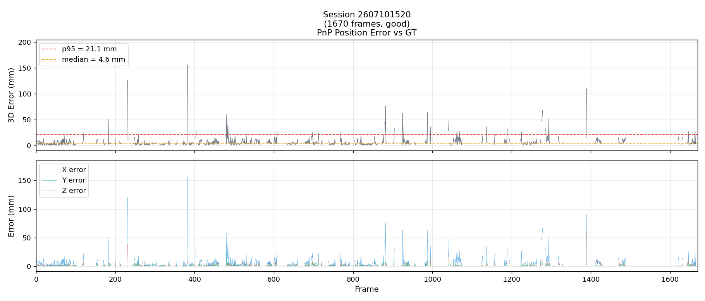
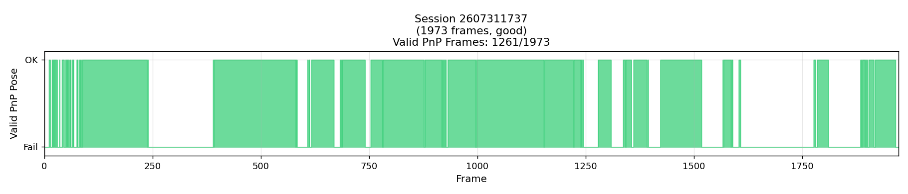
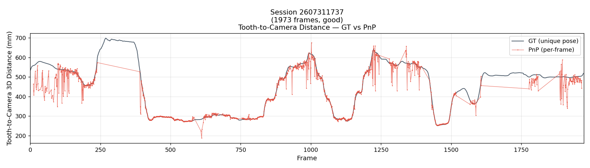
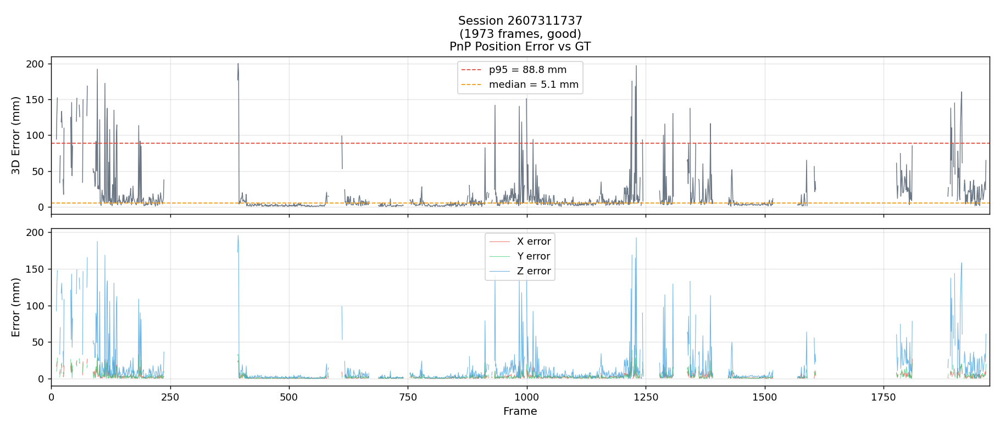

# Tooth-Pose 数据集创建与 GT 生成

## 1. 数据集概览

三个数据集位于 `Codebase/new_dataset/`，目录结构统一：

```
2607091225/              # 第一组 (969 帧)
  meta.json              # 元数据
  intrinsics.txt         # 3x3 内参
  tooth_pose_gt.csv      # GT: frame,valid,qw,qx,qy,qz,tx_mm,ty_mm,tz_mm
  frames_lossless.mkv    # 原始视频
  tooth_model.ply        # 牙齿模型
  raw_meta/              # 原始数据 + 推导过程
    calib.json
    camera_poses.jsonl           # 相机位姿 (SLAM world, 4x4)
    tooth_poses.jsonl            # 牙齿位姿 (Unity stream)
    pnp_featlightglue_predictions.jsonl  # 逐帧 PnP 结果
    unique_tooth_pose_full.json  # 唯一牙齿世界位姿 + 每帧投影结果
    ...
```

| 数据集 | 帧数 | 分辨率 | fx | fy | PnP 成功帧 | 备注 |
|--------|------|--------|----|----|-----------|------|
| 2607091225 | 969 | 1920x1080 | 1447.9 | 1446.7 | 617/969 | 缺少逐帧内参；运动过剧烈，误差较大 |
| 2607101520 | 1670 | 1920x1080 | 1455.8 | 1454.8 | 806/1670 | 质量好的 GT |
| 2607311737 | 1973 | 1504x846 | 1144.2 | 1145.8 | 1261/1973 | 质量好的 GT |

## 2. 实验采集

### 2.1 硬件与场景

- **牙齿**: 固定在上颌模型上的真实牙齿，在场景中静止不动
- **相机**: HoloLens 2 的 PV (photo/video) 摄像头，手持绕牙齿移动拍摄
- **环境**: 室内，牙齿放在桌面上，自然光照

### 2.2 采集流程

1. **HL2 录制**: 启动 HL2 上的 Unity 采集 App，同时录制：
   - PV 视频流（15 fps, PNG 帧序列）
   - 相机位姿流（SLAM tracking, 4x4 矩阵，QPC 100ns ticks 时间戳）
   - 牙齿位姿流（toothA anchor + targetCamera 位姿，Unix 时间戳）
2. **时间戳对齐**: PV 帧与相机位姿通过最小化时间戳差匹配（`01_overview.py`），
   保存为 15fps 视频。新格式（260731xxx）的相机位姿使用 HL2 QPC 100ns ticks，
   旧格式（260709/260710）使用 Unix 秒。
3. **传输**: 通过 `raw_meta/note.txt` 记录的时间戳修正，将 HL2 本地时间转为 Unix 时间。

## 3. 逐帧处理管线（XFeat + LightGlue + PnP）

管线位于 `Codebase/new_exps/exp_new_offline/`，分 GPU 阶段和 CPU 阶段。

### 3.1 阶段总览

```
02_crop.py (GPU)        手工程裁剪 + 上采样
03_xfeat.py (GPU)       XFeat 特征提取（每帧 1024 keypoints）
03_xfeat_guide.py (GPU) XFeat 提取 14 个 guide view 特征
04_lightglue.py (GPU)   LightGlue 匹配 PV 帧 vs 14 个 guide view
05_pnp.py (CPU)         单 guide view PnP（per-view）
05_pnp_neighbor.py (CPU) 邻居合并 PnP（最终输出）
```

### 3.2 Guide Views

使用 14 个预渲染的 guide view (`demo_script/out/guide_views_4/`)，包含：
- 每个 view 的 `rgb.png`（600x400 渲染图）
- `xyz.npz`（3D 世界坐标 + valid mask）
- `meta.json`（14 个 view 的 K 矩阵 + nearest_neighbors 邻接关系）

这些 guide view 是**模拟的 toothA view**（通过 Unity 对牙齿模型从不同角度渲染得到），
**不是** real PV 帧采集的 guide view。

### 3.3 裁剪策略（02_crop.py）

- **手工程裁剪**: 图像中间 1/3 水平 x 下半 1/2 垂直，紧贴牙齿区域
- **上采样**: 1.5x (`upsample=1.5`)
- 保存为 `bbox/<fid>.png` + `bbox/<fid>.json`（含裁剪后的内参 K_crop）

### 3.4 XFeat 配置（03_xfeat.py）

- **模式**: `sparse`（top-k 稀疏特征）
- **top-k**: 1024（默认，`OfflineConfig.top_k = 1024`）
- **min_conf**: 0.1
- 每帧保存到 `xfeat/<fid>.npy`（keypoints, scores, descriptors）

### 3.5 LightGlue 配置（04_lightglue.py）

- **匹配策略**: 逐对匹配（single-pair），**不使用 batch 模式**
  （batch 模式会共享内部 LightGlue buffer 导致跨 view 结果污染）
- 每帧匹配全部 14 个 guide view
- 保存到 `guideviews/view_<gid>/lightglue/<fid>.npy`（pr: guide kpts, pc: crop kpts）
- **guide_mask**: 默认关闭；开启后只保留 guide keypoints 中落在牙齿有效区域的点

### 3.6 PnP 配置

#### 3.6.1 Per-view PnP（05_pnp.py）

- **求解器**: `poselib.estimate_absolute_pose`
- **相机模型**: PINHOLE
- **RANSAC**: `max_reproj_error=4.0`, `min_iterations=100`, `max_iterations=100000`, `success_prob=0.999`
- **门限**: 一个 view 需要 >= 4 个 LightGlue 匹配且 >= 4 个落在有效 3D 深度上才运行 PnP
- 保存到 `guideviews/view_<gid>/pnp/<fid>.yaml`

#### 3.6.2 Merged PnP / Neighbor PnP（05_pnp_neighbor.py）

**最终输出策略** - 这是当前使用的核心方法：

1. 对所有 14 个 guide view 运行 per-view PnP
2. **按 PnP inlier 数量排序**，取最佳 view
3. 从 `meta.json` 读取最佳 view 的 `nearest_neighbors`（预计算的邻接 view）
4. **合并**最佳 view + 最多 3 个邻居（共 ≤4 个 view）
5. **2D 去重**: 对合并后的 3D-2D 对应点，在 crop 像素空间做去重（`dup_radius=3.0 px`）
6. **合并 PnP**: 对去重后的点集运行 PnP
7. 保存到 `pnp_neighbor/<fid>.yaml`

**关键参数**:
- `max_views=4`（最多合并 4 个 guide view）
- `dup_radius=3.0`（2D 去重半径）
- `kpts_min=30`（单个 view 匹配数 > 30 才参与合并）
- `total_max=200`（合并总点数 > 200 即停止）
- `ransac_reproj=4.0`

### 3.7 分段运行

由于 XFeat/LightGlue 的 GPU 显存累积问题，约 450 帧后会 segfault，因此采用分块运行：

```
run_all.py -> run_round1.py (分块: 每块 100 帧, 各块独立进程)
  -> 每块内部续跑机制 (跳过已处理帧)
  -> 所有块写入同一个 _round1/record.json
  -> run_round2.py (平滑 + 视频输出)
```

## 4. GT 解算

### 4.1 核心思想

牙齿在场景中**静止不动**，HL2 相机绕牙齿移动。每帧的 PnP 结果描述的是**同一个物理牙齿**的位姿：

```
T_tooth_slam(k) = cam_pv(k) @ S4 @ inv(twc(k))   [m, SLAM world]
```

其中 `twc(k)` 是第 k 帧 PnP 输出的 tooth-in-camera 位姿（world-to-camera, mm, OpenCV 约定），
`cam_pv(k)` 是相机在 SLAM 世界中的位姿，`S4 = diag(1,-1,-1,1)` 是 OpenCV 到 Unity 的坐标翻转。

### 4.2 版本迭代

#### V1: `solve_T_target_to_pv.py`（原始版本）

- 计算每帧的 `T_tooth_slam(k)`
- 用 Tukey 加权的 SO(3) 投影均值 + 平移中位数做鲁棒聚合
- 高内点帧 bundle refinement
- 输出：`T_target_to_pv`（相机外参）+ 唯一牙齿世界位姿

#### V2: `solve_T_target_to_pv_v2.py`（去噪 + 均匀空间采样）

**改进 A**: 先求解唯一世界位姿（SE(3) 切空间 M-estimator），再用它替换每帧 PnP 噪声

**改进 B**: 均匀空间采样，消除 dwell bias
- 将帧按 (depth, lateral) 分 bin
- 每 bin 最多保留 K=12 帧
- 每个 bin 等权参与求解

**改进 C**: 留一深度 bin 交叉验证

#### V3: `solve_T_target_to_pv_v3.py`（分段 + 漂移补偿）

**改进**: CE（Unity）相机轨迹随时间漂移（HoloLens spatial tracking），
因此将整个 session 按时间分段，每段求解自己的 `X_i`，然后：
- **鲁棒合并**: 对 `X_i` 做 Tukey SO(3) 均值 + 加权中位数平移，剔除异常段
- **联合漂移捆绑**: 全局 X + 每段小漂移 `C_i`，分离"X 的误差"和"CE 轨迹漂移"

#### V2 Robust: `solve_unique_tooth_robust.py`（当前使用的最终版本）

- 替换了 V2 的简单中位数平移为**完整的 SE(3) 鲁棒 M-estimator**
- 对 per-frame PnP 的置信度（inlier 数 + reprojection error）加权
- 用 Tukey 权重在 SE(3) 切空间做迭代加权均值
- 用 MAD 阈值拒绝 outlier 帧（残差超过 3*MAD 的帧被剔除）
- 在高内点集上重新估计
- 最终输出：`T_tooth_slam` + `per_frame_twc_den`（每帧去噪后的世界位姿）

### 4.3 GT 生成流程

`make_min_gt_dataset.py` 将 V2 Robust 的输出整理为标准数据集：

```
1. 读取 unique_tooth_pose_full.json 中的 per_frame_twc_den
2. 对每帧: T_tooth_to_cam = inv(per_frame_twc_den[k])
           提取旋转(四元数) + 平移(mm)
3. 写入 tooth_pose_gt.csv
4. 写入 intrinsics.txt（从 calib.json 复制，已验证正确）
5. 复制 tooth_model.ply
6. 写入 meta.json（含 GT 质量评估）
7. 将原始文件移入 raw_meta/
```

### 4.4 GT 误差

GT 误差通过比较 GT 与逐帧 PnP 的差异来估计（这是 GT 误差的上界，因为也包含 PnP 误差）：

| 数据集 | 中位数 inliers | 中位数 reproj | 3D RMS (all) | 3D RMS (high-conf) | p95 |
|--------|---------------|--------------|-------------|-------------------|-----|
| 2607091225 | 26 | 2.06 px | 2.8/4.5/10.5 mm (x/y/z) | 2.1/6.0/14.9 mm | 69.1 mm |
| 2607101520 | 53 | 2.19 px | 2.0/1.6/5.5 mm | 1.3/1.0/5.8 mm | 21.1 mm |
| 2607311737 | 38 | 2.13 px | 2.2/2.3/6.6 mm | 1.7/1.8/5.0 mm | 88.8 mm |

**注意**: 2607091225 的 p95 较大（69.1 mm），说明该 session 的 PnP 有较多大误差帧，
可能原因是运动过于剧烈导致模糊/匹配失败。2607311737 的 p95 也较大（88.8 mm），
但中位数误差（5.1 mm）比 2607091225（8.2 mm）小，说明大部分帧精度好但偶有大的 outlier。

### 4.5 内参验证

利用 GT 与内参无关的特性，通过 `(t_pnp - t_gt)/Z` 的残差来验证内参：

- `cx` 偏差 < 1.0 px
- `cy` 偏差 < 1.5 px
- 焦距误差 < 0.6%
- **结论**: calib.json 的内参正确，无需深度依赖的 delta-Y 修正

## 5. 数据集分析图

### 5.1 2607091225

<table>
  <tr><td align="center"><b>有效 PnP 位姿</b></td></tr>
  <tr><td align="center"></td></tr>
  <tr><td align="center"><b>牙齿-相机距离: GT vs PnP</b></td></tr>
  <tr><td align="center"></td></tr>
  <tr><td align="center"><b>PnP 误差 vs GT</b></td></tr>
  <tr><td align="center"></td></tr>
</table>

### 5.2 2607101520

<table>
  <tr><td align="center"><b>有效 PnP 位姿</b></td></tr>
  <tr><td align="center"></td></tr>
  <tr><td align="center"><b>牙齿-相机距离: GT vs PnP</b></td></tr>
  <tr><td align="center"></td></tr>
  <tr><td align="center"><b>PnP 误差 vs GT</b></td></tr>
  <tr><td align="center"></td></tr>
</table>

### 5.3 2607311737

<table>
  <tr><td align="center"><b>有效 PnP 位姿</b></td></tr>
  <tr><td align="center"></td></tr>
  <tr><td align="center"><b>牙齿-相机距离: GT vs PnP</b></td></tr>
  <tr><td align="center"></td></tr>
  <tr><td align="center"><b>PnP 误差 vs GT</b></td></tr>
  <tr><td align="center"></td></tr>
</table>

## 6. 总结步骤

### 采集

```
HL2 Unity App 录制 -> PV 视频流 + 相机位姿 + 牙齿位姿 -> 时间戳对齐 -> 15fps 帧序列
```

### 逐帧 PnP 管线

```
原始帧 -> 手工裁剪(中间1/3 x 下半1/2) + 1.5x上采样
  -> XFeat 稀疏特征提取 (top-k=1024, min_conf=0.1)
  -> LightGlue 逐对匹配 vs 14 guide views (single-pair, 非 batch)
  -> per-view PnP (poselib RANSAC, reproj=4.0)
  -> 按 inlier 数排序，取最佳 view + 3 个 nearest neighbors
  -> 2D 去重 (dup_radius=3px) -> 合并 PnP -> pnp_neighbor/<fid>.yaml
```

### GT 解算

```
逐帧 PnP 结果 -> T_tooth_slam(k) = cam(k) @ S4 @ inv(twc(k))
  -> SE(3) 切空间鲁棒 M-estimator (Tukey 权重 + PnP 置信度加权)
  -> MAD outlier 剔除 -> 最终唯一牙齿世界位姿 T_tooth_slam
  -> per_frame_twc_den(k) = 位姿投影回每帧 -> inv = T_tooth_to_cam(k)
  -> 提取四元数 + 平移 -> tooth_pose_gt.csv
```

### 关键文件索引

| 文件 | 路径 | 作用 |
|------|------|------|
| 管线核心 | `Codebase/new_exps/exp_new_offline/` | 02_crop ~ 05_pnp_neighbor |
| 管线核心库 | `Codebase/new_exps/exp_new_offline/pipeline_core.py` | PnP 求解、路径布局 |
| 管线辅助库 | `Codebase/new_exps/exp_new_offline/helper.py` | OfflineProcessor、EMA 平滑 |
| GT 求解 V1 | `Codebase/new_exps/exp_calibration_5/solve_T_target_to_pv.py` | 原始版本 |
| GT 求解 V2 | `Codebase/new_exps/exp_calibration_5/solve_T_target_to_pv_v2.py` | 均匀空间采样 |
| GT 求解 V3 | `Codebase/new_exps/exp_calibration_5/solve_T_target_to_pv_v3.py` | 分段漂移补偿 |
| GT 求解 Robust | `Codebase/new_exps/exp_calibration_5/solve_unique_tooth_robust.py` | 最终版本 |
| GT 数据集生成 | `Codebase/new_exps/exp_calibration_5/make_min_gt_dataset.py` | 整理为标准数据集 |
| 绘图脚本 | `Codebase/new_exps/exp_dataset/plot_dataset_analysis.py` | 本 markdown 的图表 |
| Guide views | `Codebase/demo_script/out/guide_views_4/` | 14 个预渲染 guide view |